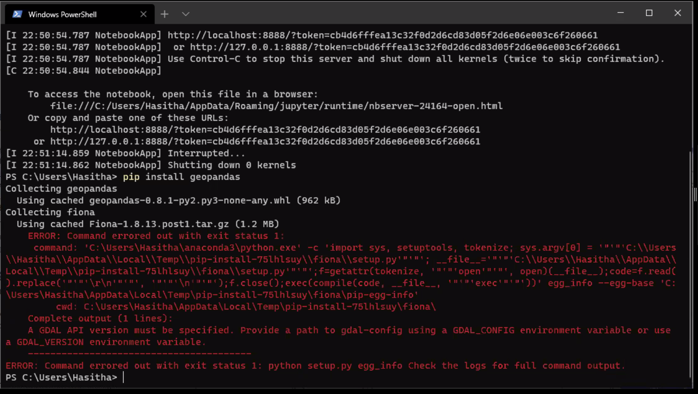

Known installation issues
=========================

Windows
-------

1. Failure to install fiona package

   Reported installation error message

.. note::

   proposed solution (incomplete)
   --------

   It appears that the gdal package is the source of the problem. We recommend downloading the
   **gdal** and **fiona** packages closest to your system configuration from

   * gdal: https://www.lfd.uci.edu/~gohlke/pythonlibs/#gdal
   * fiona: https://www.lfd.uci.edu/~gohlke/pythonlibs/#fiona

   Install those packages using

   sudo pip install gdal*.whl fiona*.whl

   

   

MacOS
------

1. "no CRS class" when import geopandas

.. note::
    Not a question, but knowledge-sharing: The issue of importing geopandas with the error of “no CRS class” in MacOS, the solution is to install the pyproj version 2.# since CRS is introduced version 2 in Pyproj. Do the following pip install pyproj==2.6.1

